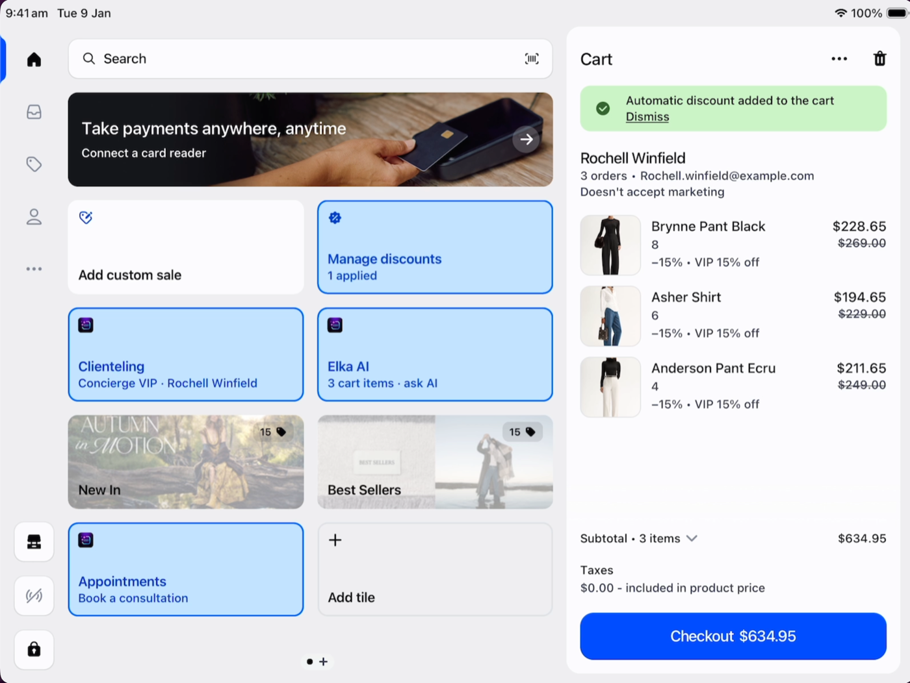
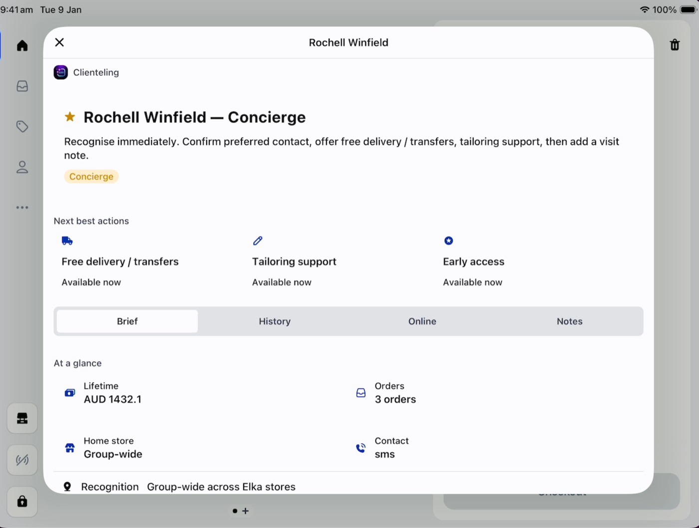
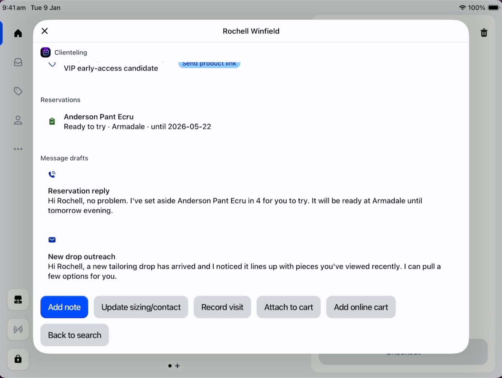
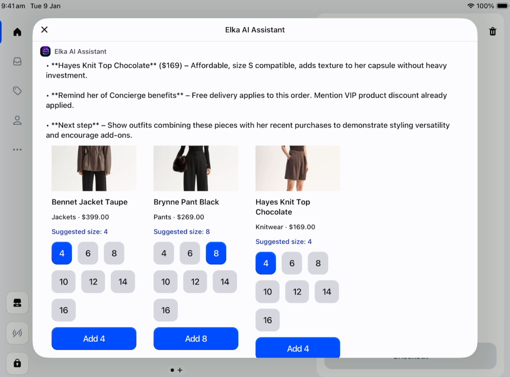
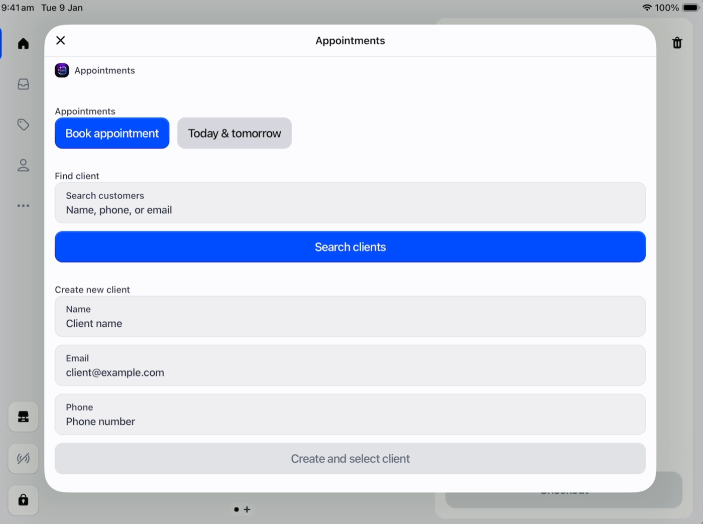
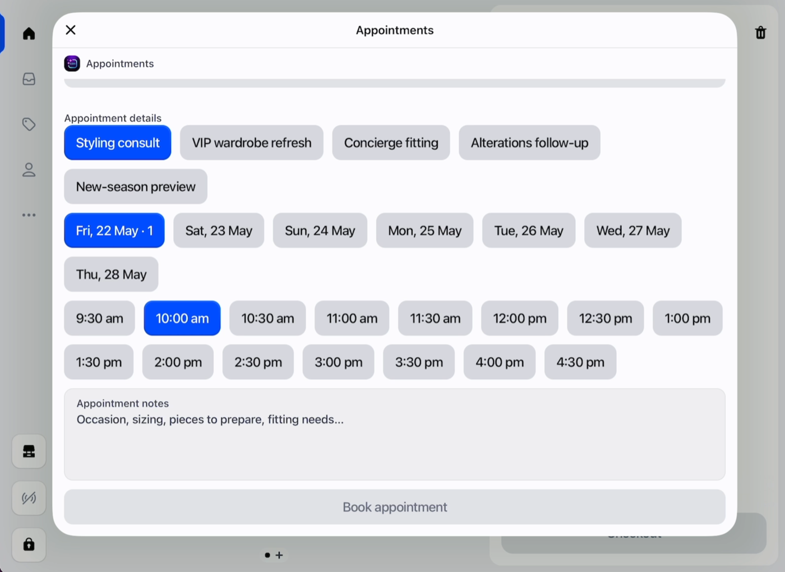
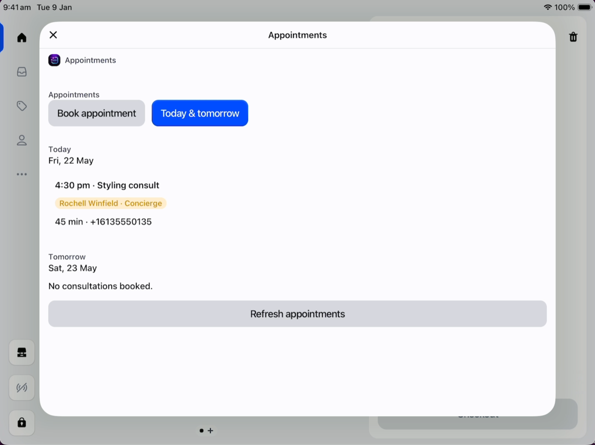

# ESR Group — POS Demo App

Shopify POS UI Extensions demo for **Early Settler / ESR Group** (furniture & homewares, high-AOV retail). Built on the Elka Clienteling pattern, adapted for an ESR in-store experience showcasing AI clienteling, manager-authorized discounts, native inventory, and Sidekick-driven purchase order forecasting.

> **Internal SE asset.** Not for production use. Repo can be transferred to `shopify-playground` org when ready.

---

## What this demo shows

| Act | Feature | Extension |
|-----|---------|-----------|
| 1 | AI clienteling — customer lookup, AI product suggestions, purchase history | `esr-customer-details-block`, `esr-home-smart-grid` |
| 2 | POS sale — delivery date picker, endless aisle (online catalogue at POS) | `esr-product-details-block`, `esr-product-details-action` |
| 2 | Manager Discount — PIN-authenticated discount with audit trail | `manager-discount` |
| 3 | AI assistant tile | `esr-ai-assistant`, `esr-ai-customer-coach-block` |
| 4 | Appointment booking | `appointment-booking-v2` |
| 4 | VIP perks (Shopify Function) | `vip` |

**Shopify-native IMS only** — no partner OMS, no D365, no Lexer. Inventory and POs managed natively in Shopify admin + Sidekick.

---

## `manager-discount` extension

Standalone (zero backend). Works entirely via native POS APIs — no server calls.

- Home tile — disabled until items are in cart
- Manager authenticates via `shopify.pinPad.showPinPad()`
- Preset discounts sized for furniture/high-AOV: **5%, 10%, 15%, $50, $100, $250 off**
- Custom amount (% or $) supported
- Discount applied via `shopify.cart.applyCartDiscount()`
- Audit trail written to cart properties: `manager_name`, `discount_type`, `discount_amount`, `discount_approved_at`

**Demo PINs:** `1234` Store Manager · `5678` Assistant Manager · `9999` Area Manager

---

## Current setup

- Dev store: `YOUR-STORE.myshopify.com`
- Partner app name: `esr-pos-demo`
- App handle: `esr-clienteling`
- Client ID: `6581aed86bdde374d8c04d295fa7f8a3`
- Local backend port: `5050`
- Current tunnel URL: `https://street-algorithm-federation-vessels.trycloudflare.com`
- Current active app version: `esr-clienteling-60`
- Repo path: `/Users/shannondutton/.cmux-runs/clienteling-20260519-090720/work/backend`

## Screenshots

These screenshots show the current POS demo experience across clienteling, AI recommendations, discounts, and appointment booking.

| POS home, discounts, and cart | Concierge clienteling profile |
| --- | --- |
|  |  |

| Clienteling online signals and actions | ESR AI assistant |
| --- | --- |
|  |  |

| AI product recommendations | Appointment client search/create |
| --- | --- |
|  |  |

| Appointment details | Today and tomorrow appointments |
| --- | --- |
|  |  |

## What the app does

### 1. Clienteling home tile

The `Clienteling` POS tile opens a staff workflow for finding and serving customers.

Capabilities:

- Search customers by name, phone, or email.
- See VIP, Concierge, and Lapsed status.
- Attach the selected customer to the POS cart.
- View recent orders, notes, interests, home store, last staff member, last visit, sizing, and preferred contact.
- Record a visit, which updates last visit/staff and home store context.
- Add a note to the customer profile.
- Capture sizing and contact preferences.
- Add catalogue-backed online cart items into the POS cart.

### 2. Customer profile surfaces

On POS customer details, the app adds production-friendly clienteling surfaces:

- `Client profile` action: richer modal for profile, history, online signals, notes, sizing/contact, and quick actions.
- `Clienteling` block: compact profile card directly on the customer details page.
- `ESR AI Coach` block: AI-generated clienteling tips for the current customer.

Customer actions include:

- Edit profile / notes.
- Record visit.
- Attach customer to cart.
- Add online cart items to cart.
- Draft reach-out guidance from customer context.

### 3. Product interest and outreach

On POS product details, the app shows matched customer interest for the current product.

Capabilities:

- Infer product interest from real product collections, title, product type, vendor, and tags.
- Map Elka catalogue products to client interest categories.
- Show local and total matched customer counts.
- Open a product outreach modal with matched customers.
- Prioritize outreach suggestions using home store, tags, and clienteling signals.

### 4. ESR AI assistant

The `ESR AI` POS tile opens a sales assistant with four modes:

| Mode | Purpose |
| --- | --- |
| Clienteling | What to say next for this customer. |
| Perks | VIP/Concierge perk guidance without inventing discounts. |
| Products | Real Elka catalogue recommendations for the customer/cart. |
| Outreach | Short follow-up draft using preferred channel and products. |

AI context includes:

- Attached cart customer.
- Cart line items.
- Customer tags, spend, order count, last visit, sizing, and contact preference.
- VIP/Concierge rules.
- Real active Elka catalogue products.

AI product recommendation cards can:

- Show product image, title, type, and price.
- Suggest a size from saved customer sizing.
- Let staff choose another available variant.
- Disable unavailable variants.
- Add the selected variant directly to the POS cart.

### 5. Appointment booking

The `Appointments` POS tile lets staff book and view in-person consultations.

Capabilities:

- Search existing Shopify customers by name, phone, or email.
- Select a searched customer for the appointment.
- Create a new Shopify customer from the booking flow and assign the appointment to them.
- Use separate tabs for booking and today's/tomorrow's appointments.
- Pick a date from the seven-day calendar buttons.
- Choose a time slot and consultation type.
- Capture appointment notes such as occasion, sizing, or pieces to prepare.
- View a seven-day calendar summary with daily appointment counts.
- View the selected day's consultations.
- View the next upcoming consultations.
- Store appointment data in a shop metafield so it is shared across POS devices for the app.

MVP limitation: this is an in-app consultation calendar, not a Google Calendar or external calendar integration yet.

### 6. VIP & Concierge perks

The app includes a Shopify Function extension named `VIP & Concierge perks` with handle `vip`.

Current discount rules:

- Customer tagged `vip` or `VIP` receives the configured VIP product percentage discount.
- Customer tagged `concierge` or `Concierge` also receives the VIP product percentage discount.
- Concierge customers can also receive free delivery when enabled.
- Gift lines with `_elka_gift=true` receive 100% product discount.

Important: Concierge is treated as a higher service tier. Concierge customers do **not** need a separate VIP tag to receive the VIP product discount.

### 7. Catalogue-backed demo data

The seed script creates realistic demo customers and derives product examples from real active `Early Settler` catalogue products. It avoids fake product names.

Seeded customers:

| Customer | Role |
| --- | --- |
| Ava Montgomery | VIP + Concierge |
| Mila Ashford | Concierge-only |
| Sienna Vale | VIP |
| Harper Quinn | VIP |
| Isla Rowe | Lapsed VIP |
| Zoe Bennett | VIP |
| Nina Hartley | Non-VIP demo customer |
| Lucy Carter | Concierge-only |

## Quick start / restart flow

Use this when the backend or Cloudflare tunnel has stopped, or when Cloudflare gives you a new URL.

### 1. Start the local backend

Terminal 1:

```sh
cd /Users/shannondutton/.cmux-runs/clienteling-20260519-090720/work/backend
PORT=5050 pnpm run dev:local
```

Leave this running.

### 2. Start a Cloudflare tunnel

Terminal 2:

```sh
cloudflared tunnel --url http://localhost:5050
```

Copy the new `https://...trycloudflare.com` URL.

### 3. Sync the tunnel URL

Terminal 3:

```sh
cd /Users/shannondutton/.cmux-runs/clienteling-20260519-090720/work/backend
pnpm tunnel:sync https://YOUR-NEW-TUNNEL.trycloudflare.com
```

This updates:

- `.env` → `SHOPIFY_APP_URL`
- `shopify.app.toml` → `application_url`
- `shopify.app.toml` → OAuth redirect URLs
- all active POS extension `src/shared/config.ts` files → `BACKEND_URL`

### 4. Build and deploy

```sh
pnpm run build
pnpm shopify app deploy --allow-updates --message "Update tunnel URL"
```

### 5. Reopen Shopify POS

Fully close and reopen Shopify POS so the latest CDN-hosted extension bundles are loaded.

## Demo walkthrough

### Clienteling workflow

1. Open Shopify POS.
2. Tap `Clienteling`.
3. Search for a demo customer, or attach an existing cart customer.
4. Show badges, sizing, preferred contact, recent orders, notes, online signals, and next best actions.
5. Tap `Record visit` to update last visit/staff/home store.
6. Tap `Update sizing/contact` and save top, bottom, dress, shoe, bra, fit notes, and preferred contact.
7. If the customer has an online cart, tap `Add online cart` / `Add these items to cart`.

### Customer details workflow

1. Open a customer in POS.
2. Show the compact `Clienteling` block.
3. Show the `ESR AI Coach` block.
4. Open `Client profile` for the full customer workflow.
5. Capture notes, sizing/contact, visit context, and cart attachment from the modal.

### Product workflow

1. Open an Elka catalogue product in POS.
2. Show `Client interest` / interested clients.
3. Open the product outreach modal to view matched customers.
4. Use this as the staff prompt for new-drop or back-in-stock outreach.

### Appointments workflow

1. Tap `Appointments`.
2. On the `Book appointment` tab, search for an existing customer by name, phone, or email.
3. Select the customer, or create a new client and select them from the booking flow.
4. Choose the consultation type, date, and time.
5. Add notes such as occasion, sizing, or pieces to prepare.
6. Tap `Book appointment`.
7. Use the `Today & tomorrow` tab to see upcoming in-person consults for today and tomorrow.

### ESR AI workflow

1. Attach a customer to the cart.
2. Add an Elka product to cart.
3. Tap `ESR AI`.
4. Use `Products` mode and ask: `What should I show with this cart?`
5. Show the AI guidance, product cards, image thumbnails, size buttons, and add-to-cart action.
6. Switch to `Outreach` mode to draft a follow-up message.

### VIP / Concierge workflow

1. Attach a VIP or Concierge customer to cart.
2. Add an eligible product.
3. Confirm staff-facing clienteling prompts show the customer tier and expected perks.
4. If validating checkout behavior, confirm the automatic app discount has been created and is active.

## Seeding demo data

Run when customer data, interest tags, sizing/contact metafields, or catalogue-derived demo signals need refreshing:

```sh
pnpm run seed
```

The seed script:

- Loads active `Early Settler` products.
- Creates/updates demo customers.
- Adds `demo-clienteling`, VIP/Concierge/Lapsed, interest, and home-store tags.
- Writes sizing, preferred contact, and last visit metafields.
- Adds realistic notes referencing real catalogue product titles.
- Builds `$app:esr.interest_map` from real catalogue collections.

## AI proxy setup

The AI backend uses Shopify's internal AI proxy:

```env
AI_PROXY_URL=https://proxy.shopify.ai
AI_PROXY_TOKEN=shopify-...
```

Do not commit or paste the full token into docs or logs.

If AI fails:

- Confirm `.env` contains `AI_PROXY_TOKEN`.
- Confirm the local backend is running.
- Confirm the tunnel URL was synced and the app was redeployed.
- Reopen Shopify POS.

## Useful commands

```sh
# Run backend locally
PORT=5050 pnpm run dev:local

# Start Cloudflare tunnel
cloudflared tunnel --url http://localhost:5050

# Sync tunnel URL everywhere
pnpm tunnel:sync https://YOUR-NEW-TUNNEL.trycloudflare.com

# Build backend and validate Remix app
pnpm run build

# Deploy/release app version
pnpm shopify app deploy --allow-updates --message "Your deploy message"

# Seed demo data
pnpm run seed

# Check active app versions
pnpm shopify app versions list

# Check backend port
lsof -nP -iTCP:5050 -sTCP:LISTEN

# Check tunnel response
curl -i --max-time 10 https://YOUR-TUNNEL.trycloudflare.com/
```

## Active extensions

Configured in `shopify.app.toml`:

| Extension | Staff-facing label | Purpose |
| --- | --- | --- |
| `extensions/esr-home-smart-grid` | Clienteling | POS home tile and customer search/clienteling modal. |
| `extensions/esr-customer-details-action` | Client profile | Customer details menu action and full profile modal. |
| `extensions/esr-customer-details-block` | Clienteling | Compact customer details block and companion edit modal. |
| `extensions/esr-product-details-action` | Client outreach | Product details action modal for matched customers. |
| `extensions/esr-product-details-block` | Client interest | Product details block for customer interest counts. |
| `extensions/esr-ai-assistant` | ESR AI Assistant | POS home AI tile and assistant modal. |
| `extensions/esr-ai-customer-coach-block` | ESR AI Coach | Customer details AI coaching block. |
| `extensions/appointment-booking-v2` | Appointments | Scaffolded POS appointment booking tile and consultation calendar modal. |
| `extensions/vip` | VIP & Concierge perks | Shopify Function for product/shipping/gift discounts. |

Do not use old `extensions/clienteling` as the source of truth. It remains on disk but is not the active deployed split-extension setup.

## Troubleshooting

### POS still calls an old tunnel URL

Run:

```sh
pnpm tunnel:sync https://YOUR-NEW-TUNNEL.trycloudflare.com
pnpm run build
pnpm shopify app deploy --allow-updates --message "Update tunnel URL"
```

Then fully close and reopen Shopify POS.

### Tunnel works but POS API calls fail

Check:

- Backend is running on port `5050`.
- Cloudflare tunnel points at `http://localhost:5050`.
- The latest tunnel URL was synced into extension config.
- App was redeployed after syncing the URL.
- Shopify POS was fully reopened.

### VIP function deploy fails with trampoline/SIGKILL

Keep the current WASI setup. Do not revert the VIP function to `shopify_function` 2.x / `wasm32-unknown-unknown` unless the local trampoline issue is solved.

Working setup:

- `shopify_function = "0.8.1"`
- `graphql_client = "0.14.0"`
- build target: `wasm32-wasip1`
- wasm path: `target/wasm32-wasip1/release/vip.wasm`

### Typecheck is noisy

`pnpm run build` is the reliable validation command for this prototype. Project-wide `pnpm run typecheck` can be noisy because retired POS extension files remain on disk.

## Production UI copy rule

Keep POS-facing labels staff-friendly and non-technical. Avoid exposing implementation terms such as `block`, `extension`, `target`, `render`, `smart grid`, `init failed`, `render crashed`, or `No interest mapping` in visible UI.
